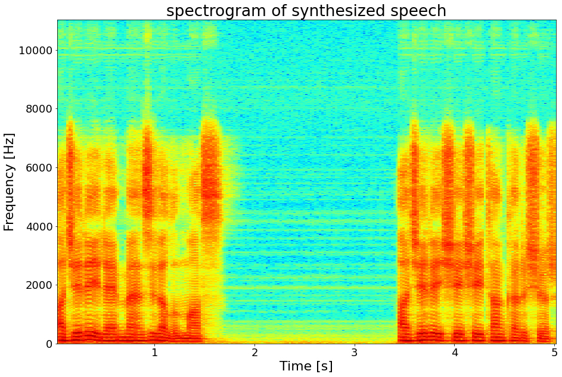

# Turkish-TTS

Turkish Speech Synthesis Project based on Tacotron2

# Tacotron 2 (without WaveNET and HiFi-GAN)

Tuskish implementation of [A Novel End-to-End Turkish Text-to-Speech (TTS) System via Deep Learning]
(MDPI, electronics). 

This implementation includes **distributed** and **automatic mixed precision** support
and uses the [Turkish TTS dataset](https://drive.google.com/file/d/1YMwTLczUs9bs-0Ukg3zlxoMrnteveiiM/view).

Distributed and Automatic Mixed Precision support relies on NVIDIA's [Apex] and [AMP].

Visit our [link](https://drive.google.com/drive/folders/187kcirx-gwQLg4nfzovhX2FNrMTz9njc) for audio samples using our Tacotron 2 and 
HiFi-GAN models.

## Pre-requisites
1. NVIDIA GPU + CUDA cuDNN

## Setup
1. Download and extract the [Turkish TTS Corpus](https://drive.google.com/file/d/1YMwTLczUs9bs-0Ukg3zlxoMrnteveiiM/view)
2. Clone this repo: `git clone https://github.com/NVIDIA/tacotron2.git`
3. CD into this repo: `cd tacotron2`
4. Initialize submodule: `git submodule init; git submodule update`
5. Update .wav paths: `sed -i -- 's,DUMMY,ljs_dataset_folder/wavs,g' filelists/*.txt`
    - Alternatively, set `load_mel_from_disk=True` in `hparams.py` and update mel-spectrogram paths 
6. Install [PyTorch 1.0]
7. Install [Apex]
8. Install python requirements or build docker image 
    - Install python requirements: `pip install -r requirements.txt`

## Symbols
Symbols are set for Turkish.

## Turkish Abbreviations
Turkish Abbreviations [Txt File](abbreviations.txt)

## Numbers
 Numbers are set for Turkish.
 
## Cleaners
Cleaner sare set for Turkish. (deepzeka_cleaners)

## Training
1. `python train.py --output_directory=outdir --log_directory=logdir`
2. (OPTIONAL) `tensorboard --logdir=outdir/logdir`

## Training using a pre-trained model
Training using a pre-trained model can lead to faster convergence  
By default, the dataset dependent text embedding layers are [ignored]

1. `python train.py --output_directory=outdir --log_directory=logdir -c tacotron2_statedict.pt --warm_start`

## Multi-GPU (distributed) and Automatic Mixed Precision Training
1. `python -m multiproc train.py --output_directory=outdir --log_directory=logdir --hparams=distributed_run=True,fp16_run=True`

N.b.  When performing Mel-Spectrogram to Audio synthesis, make sure Tacotron 2
and the Mel decoder were trained on the same mel-spectrogram representation. 

## Tacotron2 and HiFi-GAN Inference Notebook
Tacotron2 and HiFi-GAN Inference [Notebook](https://colab.research.google.com/drive/1dxVcqe4m-AU8NAA1I1MW1N9HYBO_oii_?usp=sharing)

## Acknowledgements
This implementation uses code from the following repos: [Nvidia](https://github.com/NVIDIA/tacotron2),
[Keith Ito](https://github.com/keithito/tacotron/), 
[Prem Seetharaman](https://github.com/pseeth/pytorch-stft) as described in our code.

We are inspired by [Ryuchi Yamamoto's](https://github.com/r9y9/tacotron_pytorch)
Tacotron PyTorch implementation.

We are thankful to the Tacotron 2 paper authors, specially Jonathan Shen, Yuxuan
Wang and Zongheng Yang.

[WaveGlow]: https://drive.google.com/open?id=1rpK8CzAAirq9sWZhe9nlfvxMF1dRgFbF
[Tacotron 2]: https://drive.google.com/file/d/1c5ZTuT7J08wLUoVZ2KkUs_VdZuJ86ZqA/view?usp=sharing
[pytorch 1.0]: https://github.com/pytorch/pytorch#installation
[website]: https://nv-adlr.github.io/WaveGlow
[ignored]: https://github.com/NVIDIA/tacotron2/blob/master/hparams.py#L22
[Apex]: https://github.com/nvidia/apex
[AMP]: https://github.com/NVIDIA/apex/tree/master/apex/amp
